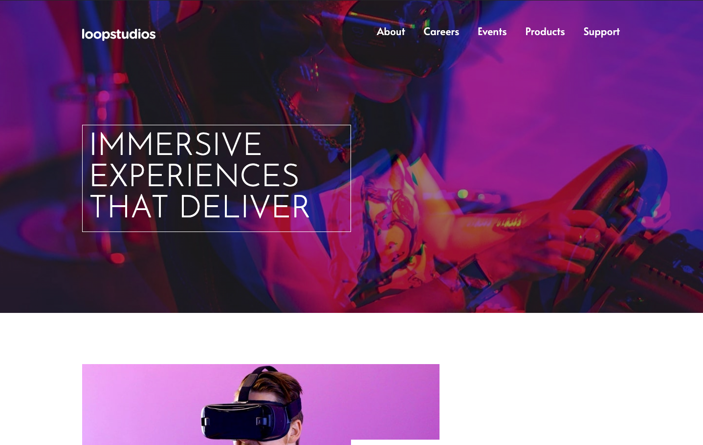

# Frontend Mentor - Loopstudios landing page solution

This is a solution to the [Loopstudios landing page challenge on Frontend Mentor](https://www.frontendmentor.io/challenges/loopstudios-landing-page-N88J5Onjw). Frontend Mentor challenges help you improve your coding skills by building realistic projects.

## Table of contents

- [Overview](#overview)
  - [The challenge](#the-challenge)
  - [Screenshot](#screenshot)
  - [Links](#links)
- [My process](#my-process)
  - [Built with](#built-with)
  - [What I learned](#what-i-learned)
  - [Useful resources](#useful-resources)
- [Author](#author)
- [Acknowledgments](#acknowledgments)

## Overview

### The challenge

Users should be able to:

- View the optimal layout for the site depending on their device's screen size
- See hover states for all interactive elements on the page

### Screenshot

### Links

- Solution URL: [Github](https://github.com/Barbelitos/FrontEndMentor-LoopStudiosLandingPage)
- Live Site URL: [Live Site](https://barbelitos.github.io/FrontEndMentor-LoopStudiosLandingPage/)

## My process

### Built with

- HTML5
- CSS
- Flexbox
- CSS Grid
- Mobile-first workflow
- JavaScript

### What I learned

Good learning about positioning elements and mobile first workflow.

### Useful resources

## Author

- Github - [Barbelitos](https://github.com/Barbelitos)
- Frontend Mentor - [@Barbelitos](https://www.frontendmentor.io/profile/Barbelitos)

## Acknowledgments
